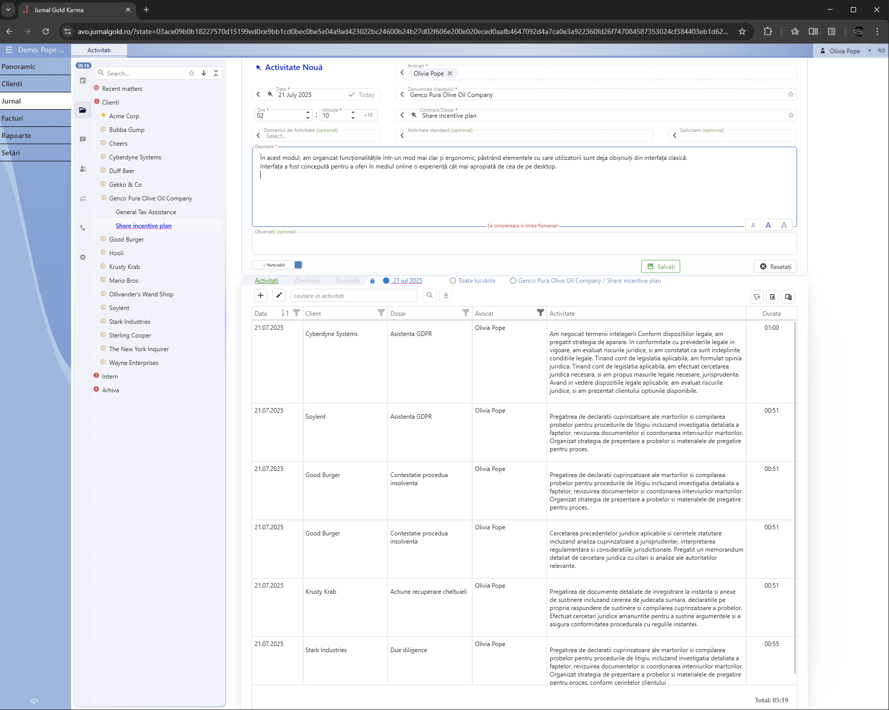
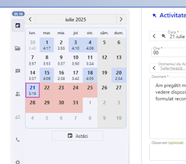
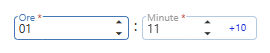
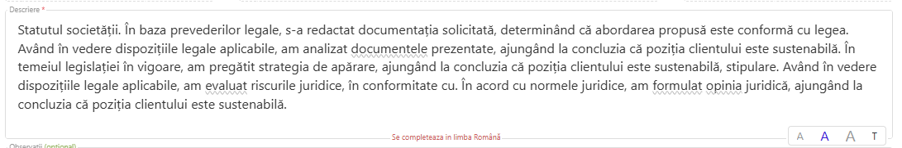
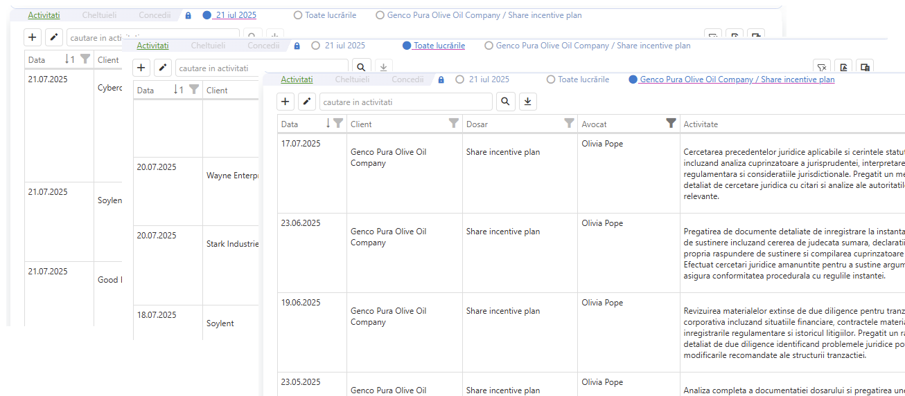
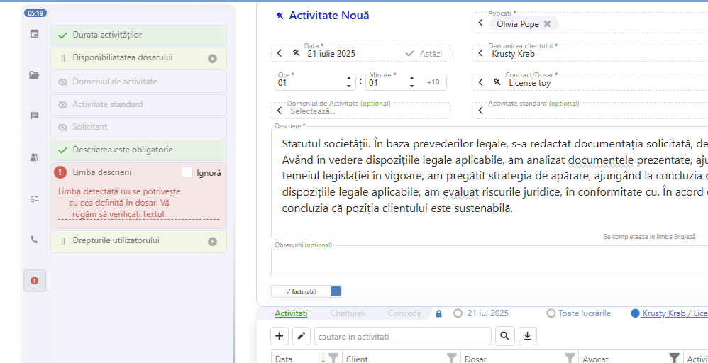
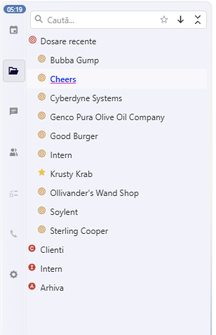
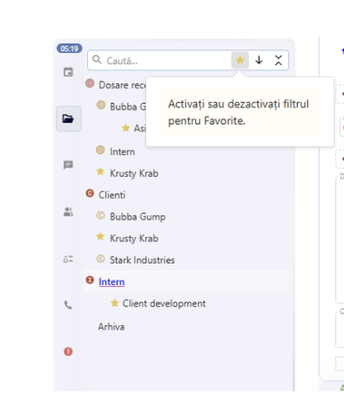
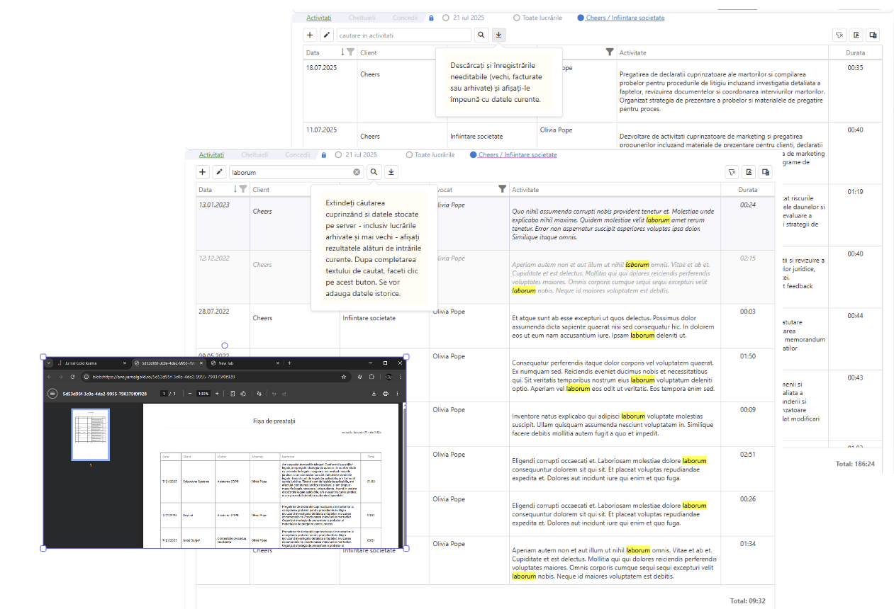

# Gestionarea activităților în Jurnal Gold Karma (v.0.4)

## Ce este Jurnal Gold Karma?

Jurnal Gold Karma este o reinterpretare și o extindere a funcționalităților Jurnal Gold în accepțiunea lor clasică, folosind tehnologii și interfețe grafice moderne.

Aceste reinterpretări sau extinderi pot rula în interfața desktop, ca parte a acesteia, dar pot la fel de bine să fie portate în sisteme de aplicații web.

## Privire de ansamblu asupra gestionării activităților în Jurnal Gold Karma

În acest modul, am organizat funcționalitățile într-un mod mai clar și ergonomic, păstrând elementele cu care utilizatorii sunt deja obișnuiți din interfața clasică.

Interfața a fost concepută pentru a oferi în mediul online o experiență cât mai apropiată de cea de pe desktop.

### Îmbunătățiri notabile
- Am adus **calendarul** din ”Breakdown” în pagina principală

  

- Introducere separată pentru ore și minute, cu buton „+10 minute”.

  

- Caseta pentru introducerea activităților este **mai mare** și poate afișa **fonturi** de dimensiuni diferite.  
- Se pot introduce texte cu **diacritice**.  
- Spellcheck mai discret.

  

- Mod de vizualizare a activităților **pe zi** | **tot** | **pe client** în aceeași pagină.

  

- Vizualizarea fiecărei **validări** în parte, premergător salvării activității.

  

### Funcționalități noi
- **”Recente”** în arborele de Clienți/Contracte am adăugat un nou nod rădăcină.

  

- **”Favorite”** marcare și filtrare mai ușoară a unor clienți sau dosare.

  

- **Căutare full-text** în activități.  
- Vizualizarea întregului **istoric** al unui dosar, direct din gridul de activități.  
- **Export** în PDF a oricărei selecții din gridul de activități, în tab diferit.

  

<!-- ---
sidebar_position: 0
---

# Gestionarea activităților în Jurnal Gold Karma

## Ce este Jurnal Gold Karma?

Jurnal Gold Karma este o reinterpretare și o extindere a funcționalităților Jurnal Gold în accepțiunea lor clasică, folosind tehnologii și interfețe grafice moderne.

Aceste reinterpretări sau extinderi pot rula în interfața desktop, ca parte a acesteia, dar pot la fel de bine să fie portate în sisteme de aplicații web.

## Privire de ansamblu asupra gestionării activităților în Jurnal Gold Karma

În acest modul, am organizat funcționalitățile într-un mod mai clar și ergonomic, păstrând elementele cu care utilizatorii sunt deja obișnuiți din interfața clasică.

Interfața a fost concepută pentru a oferi în mediul online o experiență cât mai apropiată de cea de pe desktop.

### Imbunătățiri notabile
- Am adus **calendarul** din ”Breakdown” in pagina principală

- Introducere separata **ore minute** cu buton +10 minute.

- Caseta pentru introducerea activitatilor este **mai mare** si poate afisa **fonturi** de dimensiuni diferite. 
- Se pot introduce texte cu **diacritice**.
- Spellcheck mai discret.

- Mod de vizualizare a activitatilor  **pe zi** | **tot** | **pe client**  in aceeasi pagina.

- Vizualizarea fiecarei **validari** in parte, premergator salvarii de activitate.

### Funcționalități noi
- **”Recente”** in arborele de Clienti/Contracte am adaugat un nou nod rădăcină.

- **”Favorite”** marcare si filtrare mai usoara a unor clienti sau dosare.

- **Căutare full-text** in activitati.
- Vizualizarea intregului **istoric** al unui dosar, direct din gridul din activiati.
- **Export** in pdf a oricarei selectii din gridul de activitati, în tab diferit.

 -->
