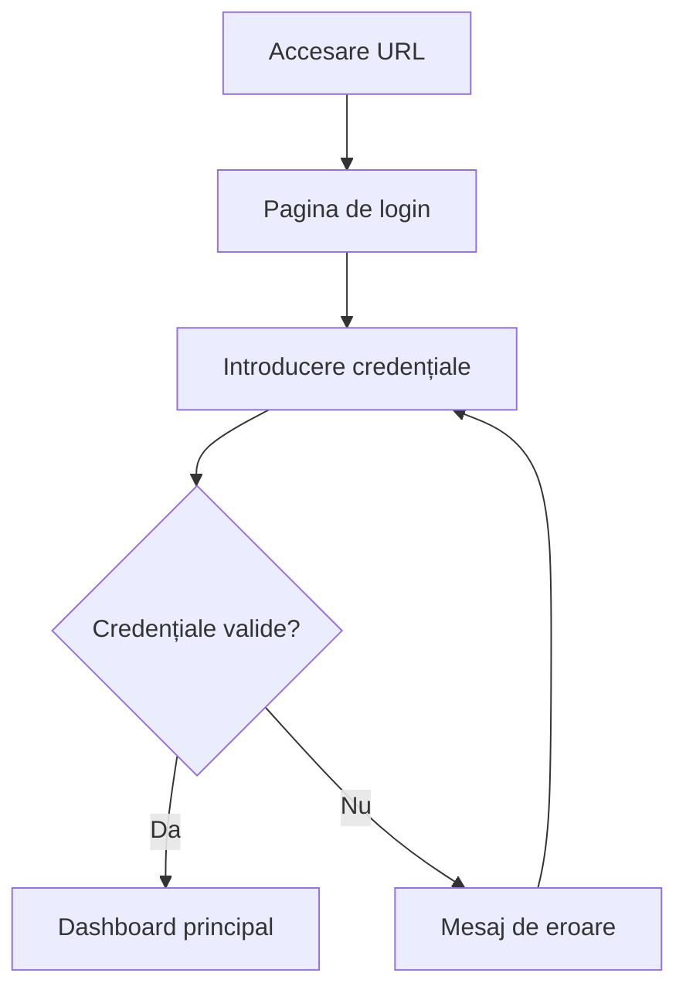

# Configurare și Acces

## Accesarea aplicației web

### URL-ul aplicației

Jurnal Gold Karma este accesibilă prin browser la adresa:

```
https://karma.jurnalgold.ro
```

:::info Notă
URL-ul poate varia în funcție de configurația serverului dumneavoastră. Contactați administratorul pentru adresa exactă.
:::

### Cerințe de sistem

#### Browser-e suportate
- **Chrome** 90+ (recomandat)
- **Firefox** 88+
- **Safari** 14+
- **Edge** 90+

#### Dispozitive suportate
- **Desktop**: Windows, macOS, Linux
- **Tablete**: iPad, Android tablets
- **Mobile**: iPhone, Android phones

#### Conexiune internet
- **Minimă**: 1 Mbps pentru funcționalitate de bază
- **Recomandată**: 5+ Mbps pentru experiență optimă
- **Offline**: Funcționalitate limitată disponibilă

## Autentificare

### Credențiale de acces

Utilizați aceleași credențiale ca pentru aplicațiile desktop Jurnal Gold:

1. **Nume utilizator**: Același ca în Jurnal Extended/Quick
2. **Parolă**: Aceeași parolă ca pentru aplicațiile desktop
3. **Server**: Se configurează automat (sau se specifică dacă este necesar)

### Procesul de login

1. **Accesați** URL-ul aplicației în browser
2. **Introduceți** numele de utilizator și parola
3. **Selectați** serverul (dacă este cazul)
4. **Apăsați** "Conectare"



### Probleme comune de autentificare

#### Parolă incorectă
- **Soluție**: Verificați caps lock, tastatura
- **Resetare**: Contactați administratorul pentru resetarea parolei

#### Utilizator inexistent
- **Cauză**: Contul nu este configurat pentru acces web
- **Soluție**: Administratorul trebuie să activeze accesul web pentru cont

#### Probleme de conexiune
- **Verificați**: Conexiunea la internet
- **Testați**: Accesul la alte site-uri web
- **Contactați**: Suportul tehnic dacă problema persistă

## Configurarea inițială

### Setări personale

După prima autentificare, configurați:

#### 1. **Preferințe de afișare**
- Limba interfaței (română/engleză)
- Formatul datei și orei
- Tema (light/dark mode)

#### 2. **Setări timesheet**
- Durata implicită a activităților
- Categorii favorite
- Notificări și reminder-e

#### 3. **Integrare cu calendar**
- Sincronizare cu Google Calendar
- Outlook integration
- Notificări de deadline-uri

### Configurarea pe dispozitive mobile

#### Instalare ca PWA (Progressive Web App)

Pe **Android (Chrome)**:
1. Accesați aplicația în Chrome
2. Apăsați meniul (⋮) → "Add to Home screen"
3. Confirmați instalarea

Pe **iOS (Safari)**:
1. Accesați aplicația în Safari
2. Apăsați butonul Share (□↗)
3. Selectați "Add to Home Screen"

#### Avantajele PWA
- **Acces rapid**: Iconiță pe ecranul principal
- **Experiență nativă**: Funcționează ca o aplicație
- **Notificări**: Push notifications pentru reminder-e
- **Offline**: Funcționalitate limitată fără internet

## Securitate și permisiuni

### Niveluri de acces

Aplicația web respectă aceleași permisiuni ca aplicațiile desktop:

| Nivel | Acces | Funcționalități |
|-------|-------|-----------------|
| **Avocat** | Propriile dosare | Introducere timesheet, vizualizare rapoarte personale |
| **Secretar** | Dosare atribuite | Introducere pentru avocați, gestionare contacte |
| **Manager** | Toate dosarele | Rapoarte complete, aprobare timesheet |
| **Admin** | Configurare sistem | Gestionare utilizatori, setări globale |

### Măsuri de securitate

#### Autentificare securizată
- **HTTPS**: Toate comunicațiile sunt criptate
- **Session timeout**: Deconectare automată după inactivitate
- **Two-factor**: Opțional, pentru securitate suplimentară

#### Protecția datelor
- **Backup automat**: Datele sunt salvate automat
- **Audit trail**: Toate modificările sunt înregistrate
- **GDPR compliance**: Respectarea regulamentelor de protecție a datelor

:::warning Atenție
Nu salvați parola în browser-e publice sau partajate. Deconectați-vă întotdeauna după utilizare pe dispozitive comune.
:::

## Suport și asistență

### Resurse de ajutor

- **Documentație**: Această secțiune de help
- **Video tutorials**: Disponibile în aplicație
- **FAQ**: Întrebări frecvente în secțiunea Help

### Contact suport

- **Email**: support@jurnalgold.ro
- **Telefon**: +40 XXX XXX XXX
- **Chat**: Disponibil în aplicație (ore de program)

### Raportarea problemelor

Pentru raportarea bug-urilor sau sugestii:
1. Descrieți problema în detaliu
2. Includeți browser-ul și versiunea
3. Adăugați screenshot-uri dacă este posibil
4. Specificați pașii pentru reproducerea problemei
