# Elementele vizuale

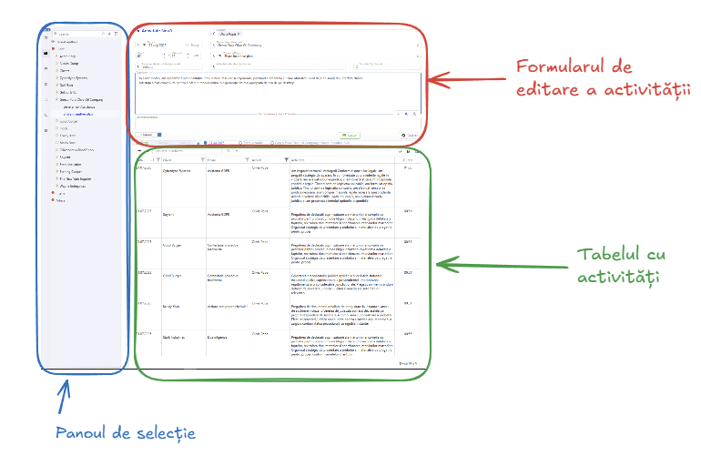
## Panoul de selecție
Acest panou se populează cu elemente grafice care orientează utilizatorul pentru completarea corectă a unei activități. 
În partea stângă este o bară verticală cu butoane pentru selecția categoriei care se completează.

### Switchul "Facturabil"

Comutatorul "Facturabil" este un comutator simplu cu valori "Facturabil" / "NeFacturabil".
Se inițializează implicit cu valoarea "Facturabil" pe dosarele "Client" și "NeFacturabil" pe dosarele "Intern".
Implicațiile setării vreunei opțiuni depind de fiecare societate în parte. 
Este posibil ca la anumite societăți să nu se afișeze deloc acest switch.

### Badge-ul cu numărul de ore și minute
De remarcat este că în partea de sus-stânga există un "badge" care arată numărul de ore și minute completate în ziua curentă.
Acesta are:
   - fundal **roșu** dacă nu există ore completate pentru ziua respectivă deși ar fi fost necesar conform baremului personal.
   - fundal **transparent** dacă timpul completat este sub baremul zilei.
   - fundal **albastru** dacă timpul completat atinge sau depășește baremul zilei.
  

  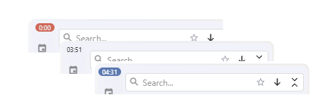

### Calendarul
Calendarul este lunar și prin funcționalitățile sale îndeplinește mai multe roluri concomitent:
    - selectarea zilei pentru care se completează activitatea 
    - selectarea zilei pentru care se afișează activitățile în tabelă, la secțiunea "data" 
    - evidențierea totalului de ore și minute pentru fiecare zi a lunii. 
    - evidențierea stării zilnice de completare a activităților în funcție de barem.
  
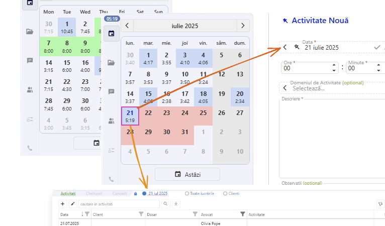

Culorile:
 -  zilele evidențiate cu **verde** sunt zilele de concediu.
 -  zilele evidențiate cu **roșu** sunt zilele de lucru pentru care nu s-au introdus activități.
 -  zilele fără evidențiere sunt zilele de lucru pentru care s-au introdus activități însă sub baremul zilei.
 -  zilele evidențiate cu **albastru** sunt zilele de lucru pentru care s-au introdus activități și au trecut baremul zilei.

:::note
Baremurile zilnice se stabilesc din Jurnal Gold/UserConfig și sunt individuale și pot diferi de la o zi a săptămânii la alta.
:::

### Arborele de clienți/dosare

Structura arborescentă Client -> Dosar se populează în funcție de drepturile de acces ale fiecărui utilizator cu dosarele pe care acesta este abilitat să introducă activități.

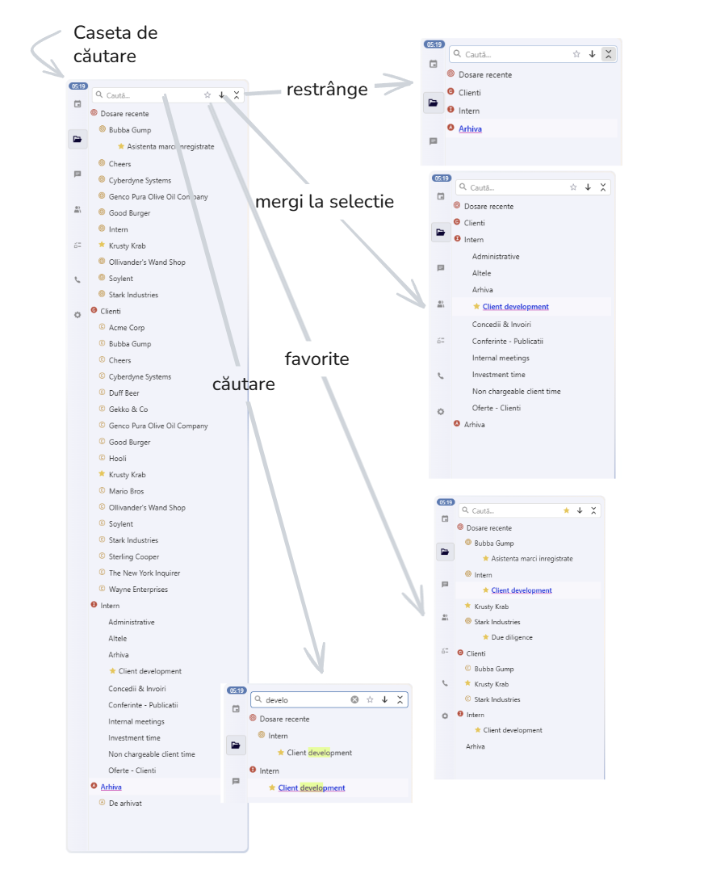

#### Caseta de căutare și butoanele ajutătoare
În partea de sus există o casetă de filtrare pentru regăsirea rapidă a unui client sau dosar. Se scrie textul căutat (3+ caractere) și se filtrează după acea selecție;

Tot în spațiul destinat casetei de căutare întâlnim și butoane pentru: 
 - Favorite - activarea / dezactivarea modului de filtrare după favorite
 - Navigare la dosarul selectat - reîntoarcere la dosarul selectat din arbore chiar dacă arborele a fost restrâns.
 - Restrângerea nodurilor arborelui la nivelul rădăcinilor (Recente, Client, Intern, Arhivă)
  
#### Recent
Primul nod este **Recente** și conține ultimele 10 dosare folosite înainte de deschiderea aplicației.

#### Clienți/Dosare 
Sunt afișate dosarele **active** pentru care utilizatorul curent are drept de introducere a activităților.

#### Intern
Sunt afișate dosarele **active** pentru care utilizatorul curent are drept de introducere a activităților.

#### Arhivă
Sunt afișate dosarele **inactive**, marcate explicit ca **arhivate**. Vizualizarea acestui nod presupune drepturi speciale de acces.

### Domeniul de activitate
Reprezintă o listă specifică de arii de practică, în care se încadrează activitatea care se prestează.
Pentru anumite dosare completarea ariei de practică poate fi obligatorie.
Structura se prezintă sub forma unei liste de selectare singulară.

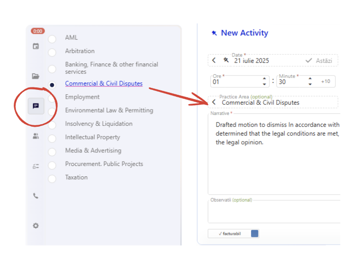

### Utilizatorii care prestează activitatea

În principiu, activitățile sunt introduse de către fiecare avocat pentru el însuși. Cu toate acestea sunt situații în care se introduc activități pentru un grup de avocați.

În funcție de drepturile de acces și de regulile interne de funcționare, această facilitate poate lipsi de la anumiți utilizatori.

Dacă însă este prezentă, înseamnă că utilizatorul are dreptul de a introduce activități și pentru colegii săi.

În acest caz, se va popula lista cu toți avocații din societate. Vor putea fi însă bifați doar avocații care au drept de introducere pentru dosarul respectiv, iar pentru ceilalți controalele vor fi dezactivate.

Aceasta este o măsură de a preveni introducerea unor activități în mod eronat, pe dosare pentru care userul nu are definite onorarii.

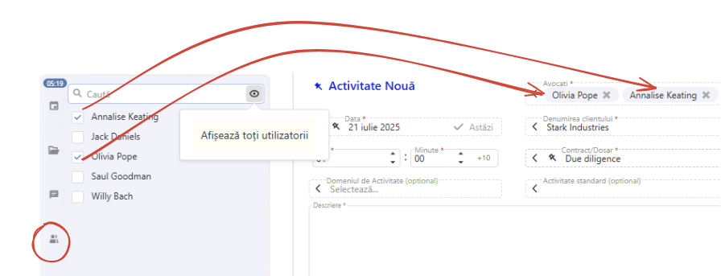

### Activitatea standard
Acest câmp este unul dintre cele mai versatile. Modul în care se va completa depinde foarte mult de setările fiecărui dosar în parte.
Sunt situații în care câmpul este opțional și altele în care este obligatoriu.
Oricum pentru utilizator, operațiunile sunt simple și foarte intuitive.

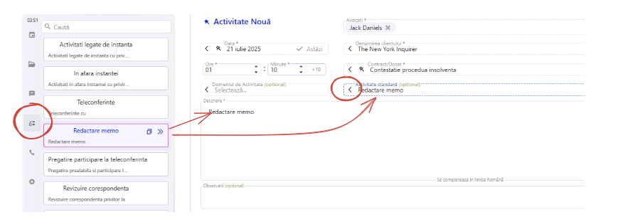

Pentru a înțelege mai bine lista de "carduri" ce reprezintă o activitate standard simplă vedeți imaginea de mai jos:

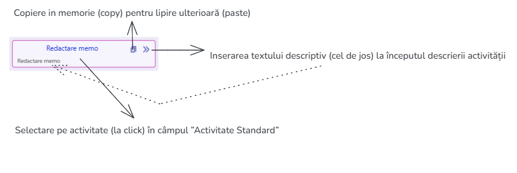

### Solicitantul
Pentru situațiile în care se dorește sau este necesar să se completeze solicitantul activității, adică persoana reprezentantă a clientului, care a cerut respectiva prestație avem o listă de selectare care permite și adăugarea unui solicitant nou.

Lista se populează cu persoanele definite în Jurnal Gold, Contacte -> Persoane împreună cu cele definite simplu în acest modul.

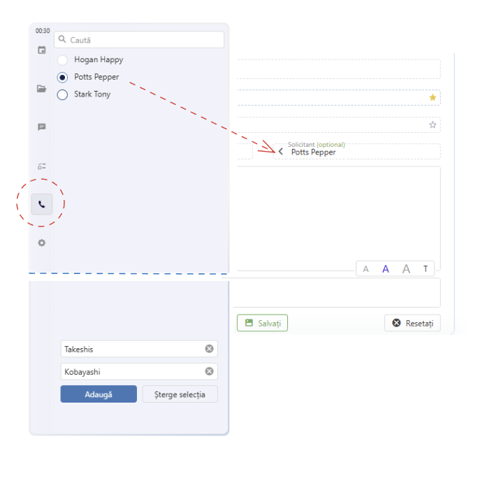

Dacă în listă nu se regăsește persoana, aceasta poate fi adăugată folosind caseta minimală de adăugare aflată în josul listei.
Adăugarea pe activitate se realizează cu click pe butonul "Adăugare".
Adăugarea propriu-zisă în baza de date se face odată cu salvarea activității.

### Panoul de validare
Regulile de validare a salvării unei activități sunt diferite de la dosar la dosar și bineînțeles în funcție de regulile proprii ale fiecărei societăți.
În panoul de validare apar "carduri" care reprezintă fiecare regulă de validare. Odată cu salvarea, pe măsură ce regulile sunt validate, cardurile evidențiază starea respectivei reguli, dacă este satisfăcută sau nu.
În anumite cazuri se pot ignora regulile nesatisfăcute prin bifare.
S-a avut grijă ca mesajele de eroare să dea informații suficiente pentru ca utilizatorul să poată corecta activitatea sau să se înțeleagă de ce aceasta nu poate fi salvată.

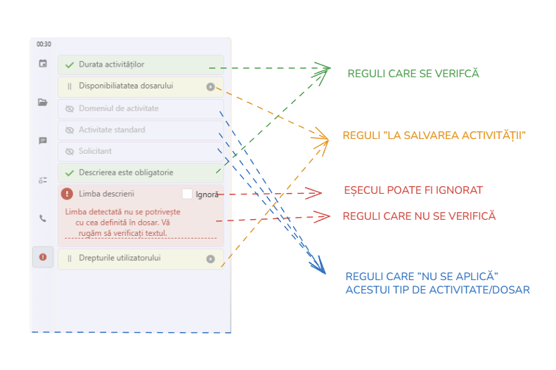

## Formularul unei activități

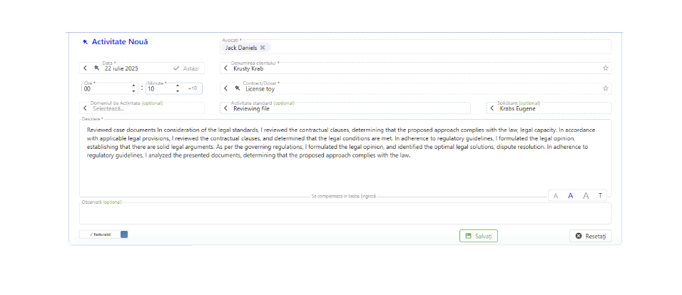

Elementele cu steluță roșie sunt obligatorii pentru dosarul respectiv. Sunt diferite de la caz la caz, în funcție de setările fiecărui dosar în parte

Despre drepturi. Vezi și editezi ce ai voie să vezi și să editezi.

### Pentru toate casetele cu săgeți la stânga

La click pe săgeata din stânga se activează în Panoul de selecție, elementul corespunzător pentru completare;

Practic la 
 - Caseta Data  deschide Panoul cu Calendar, 
  
  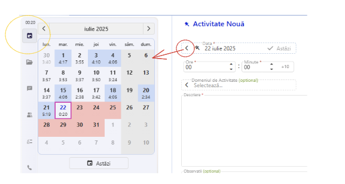

 - Caseta Avocat deschide Lista de Utilizatori,

  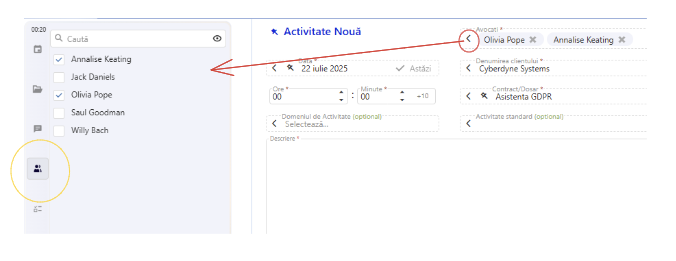

 - Caseta Client/Dosar deschide Arborele cu Clienți și Dosare,
  
  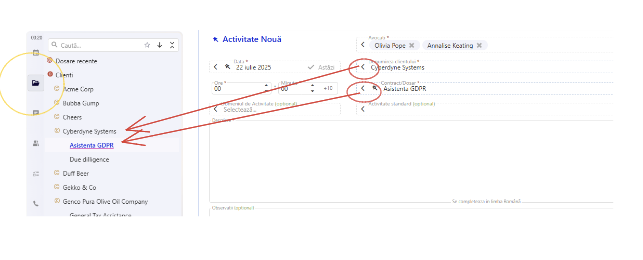

 - Caseta Domeniul de activitate deschide Lista cu Ariile de Practica / Domeniile de activitate,
 - Caseta Activitatea standard deschide Lista cu Casete de Activitate,

  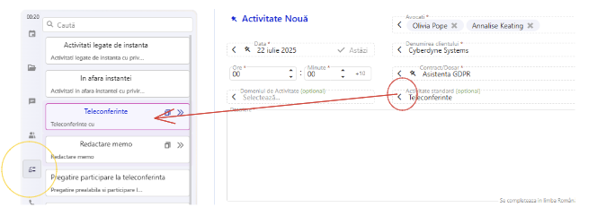

 - Caseta Solicitantul deschide Lista de Persoane

  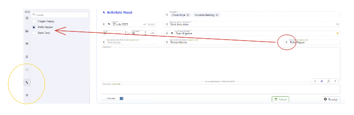

Practic, se cheamă panoul de selecție aferent casetei. Același lucru însă se poate obține și dacă se face click pe butoanele de navigare din stânga Panoului de selecție (încercuite cu galben)

### Headerul - titlu si butoane ajutătoare

Headerul are în principal rol informativ oferind detalii despre operațiunea în curs.
Câteva elemente însă merită reținute la acest element.

- "Pin" - dacă panoul nu este fixat atunci în momentul în care devine gol acesta se ascunde pentru a face loc mai mult listei de activități.
        Pentru reafișarea Formularului de activități este nevoie de click pe "+ Activitate Nouă" în headerul tabelului.

        - dacă pin-ul este deselectat (alb-negru) atunci, când se face click pe "Resetați" în dreapta jos, formularul se ascunde.
        - dacă pin-ul este selectat (starea implicită, albastru) atunci, când se face click pe "Resetați" în dreapta jos, formularul rămâne deschis.

- "Paste" - dacă este activ, lipește activitatea copiată sau tăiată pe dosarul selectat.

- "Clipboard" - deschide un mic panou în care se poate inspecta activitatea copiată sau tăiată. De asemenea, se poate goli conținutul clipboardului.

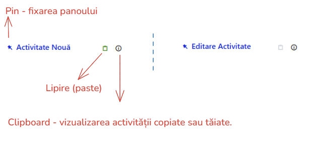

### Caseta Data

Valoarea casetei "Data" se setează din Calendar.

Valoarea implicită (la deschidere) este data curentă. Apoi se menține data ultimei activități introduse.

Navigarea prin Calendar va schimba automat valoarea casetei "Data" exceptând când este bifat "Pin" în Caseta de Data.

Valoarea casetei "Data" reprezintă data pentru care se introduc activitățile.

În cazul în care se introduc date pentru o altă zi decât ziua curentă se inițializează un buton în interiorul casetei care atrage atenția asupra unei posibile introduceri greșite și permite navigarea la ziua curentă.

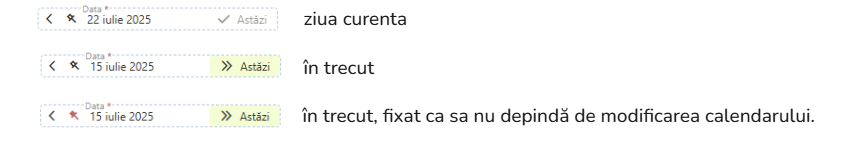

### Caseta Avocați

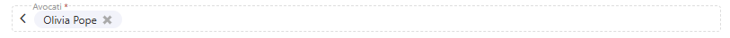

Vine automat completată cu utilizatorul curent.
Dacă sunt drepturi suficiente, utilizatorul curent poate selecta și alți utilizatori.
Lista de useri se accesează cu click pe săgeata stânga din casetă, sau direct pe butonul aferent din Panoul de selecție.
Detalii despre completare in [capitolul destinat completarii unei activitati](./2%20Introducerea%20activitatilor.md#completarea-unei-activitati-useri)

### Casetele pentru câmpurile Clienți și Dosare

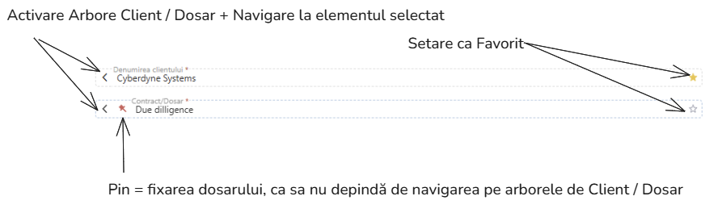

Câmpurile nu vin precompletate și sunt totdeauna obligatorii.
Cele două câmpuri se completează prin selecția unui client respectiv dosar din arborele de clienți/dosare.
Ca elemente deosebite, pe lângă săgeata din stânga (descrisă mai sus) regăsim:
- Pin (dosar) - fixarea dosarului selectat - astfel încât navigarea pe arborele de selecție să nu mai influențeze dosarul pentru care se face introducerea activităților. Este util în cazul în care, în timp ce introducem o activitate, dorim foarte rapid să vizualizăm activități de pe alte dosare - pin + select alt dosar = se actualizează lista de activități de jos și vedem ce s-a introdus până acum pentru acel dosar.
- Favorite - steluța alb/galbenă de la dreapta casetei care semnalează că respectivul contract sau dosar este unul "Favorit" sau nu. 
  
  **Nu există o limită maximă** de elemente Favorite, însă prea multe ar face ca această funcționalitate să își piardă utilitatea.

:::tip
Clienții sau Dosarele Favorite sunt "**pe utilizator**" sau "**personale**". Nu afectează alți utilizatori și nimeni nu poate accesa ce are alt utilizator în "Favorite".
::: 

:::tip
Introducerea în Favorite se poate face și cu **click dreapta** pe clientul sau dosarul respectiv din arborele de selecție.
:::

:::tip
Dacă se selectează un Client ca "Favorit" atunci toate dosarele acestuia se vor regăsi în arborele de selecție pe "nodul-scurt Favorite".
:::

Mai multe despre completarea propriu-zisă a acestor câmpuri în [capitolul destinat completării unei activități](./2%20Introducerea%20activitatilor.md#completarea-unei-activitati-client-dosar)

### Timpul de lucru (ore, minute)

Editoarele sunt limitate la 23 ore și 59 minute.
Editoarele recompun datele și salvează corect în format "hh:mm" timpul înregistrat

Mai multe detalii în [capitolul destinat completării unei activități](./2%20Introducerea%20activitatilor.md#completarea-unei-activitati-timp)

### Domeniul de activitate

Elementul vizual în tandem cu Lista de Domenii de activitate (Practice Areas)
Poate fi opțional sau obligatoriu în funcție de setările generale ale societății sau ale dosarului respectiv.

### Activitatea standard
Elementul vizual în tandem cu Lista de Activități Standard
Poate fi opțional sau obligatoriu în funcție de setările generale ale societății sau ale dosarului respectiv.

### Solicitantul
Elementul vizual în tandem cu Lista de Solicitanți
Poate fi opțional sau obligatoriu în funcție de setările generale ale societății sau ale dosarului respectiv.

### Activități
<!-- Vezi labelurile, zi de diacritice, zi de mărimea fontului
Obligatoriu tot timpul -->

Caseta pentru completarea descrierii activității se inițializează fără text în cazul unei noi activități și cu textul activității în cazul unei editări.

Elemente deosebite:

- Textul introdus se salvează ca text simplu, cu diacritice. 
- Chiar dacă la scriere putem forța stiluri de font (bold, italic, underline), la salvare acestea se pierd. Rămâne textul simplu.
- Salvarea textului introdus se face odată cu salvarea activității. Nu reține stări intermediare. Adică dacă navigăm la altă pagină între timp, textul nu se salvează.
- Permite trei dimensiuni predefinite de font pentru afișarea textului. 
- În funcție de dosar se afișează jos pe centru o etichetă cu **limba** în care trebuie completată activitatea.
- Odată cu setarea limbii pe dosar se activează și **spellerul implicit al browserului** pentru respectiva limbă.

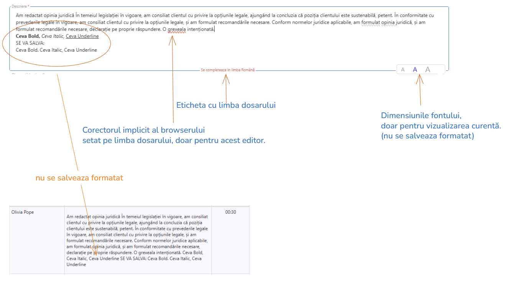

### Observații

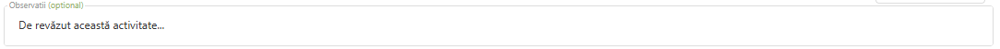

Observațiile sunt opționale și nu afectează salvarea activității.
Este o versiune mai puțin sofisticată a casetei de descriere a activității.

### Switchul ”Facturabil”

Comutatorul ”Facturabil” este un comutator simplu cu valori "Facturabil" / "NeFacturabil"
Se initializeaza implicit cu valoare "Facturabil" pe dosarele "Client" si "NeFacturabil" pe dosarele "Intern".
Implicatiile setarii vreunei optiuni depind de fiecare societate in parte. 
Este posibil, ca la anumite societati sa nu se afiseze deloc acest switch.

### Butonul de salvare

Odată cu click pe butonul de salvare, se lansează mecanismul de validare a activității.
Dacă validarea este un succes, activitatea este salvată în baza de date. 

Se vor afișa mesaje clarificatoare în orice situație.

Butonul intră într-o stare "Salvare în curs..." în timpul salvării propriu-zise. În această stare nu se mai poate face click pe acest buton.

### Butonul de resetare

- Reinițializează valorile casetelor formularului. 
- Dacă Pin-ul nu este bifat la Header [așa cum am prezentat mai sus](#headerul-label-pin-si-iconuri-de-copy-paste) atunci va și ascunde formularul.
 

## Tabelul de activități

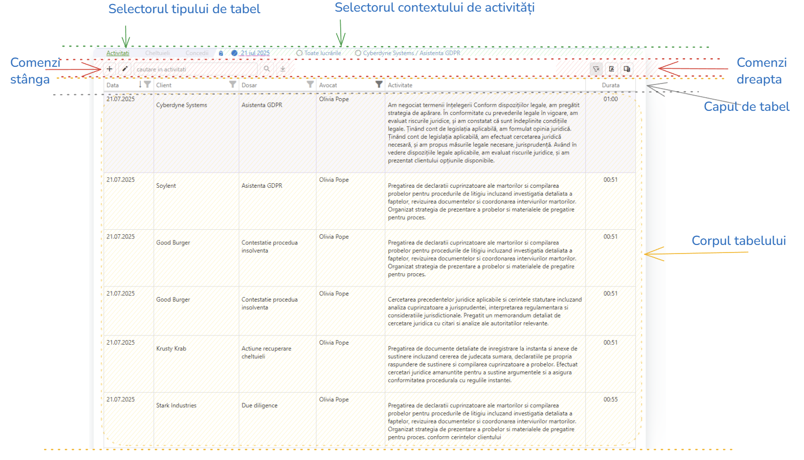

### Selectorul tipului de tabel - Activități , Cheltuieli, Concediu

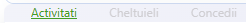

Referitor la timpi - se selecteaza modulul in contextul caruia se lucreaza.
Implicit este selectat "Activități" 
Pentru "Cheltuieli" sau "Concediu" se vor deschide intefete specializate.

### Selectorul de tabel - Activități: Data | Tot | Client

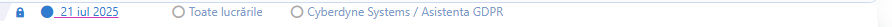

Pentru a avea cat mai la indemana contextul in care se lucreaza, in partea de sus a tabelului se gaseste un selector de context
sub forma unui grup de selectie care propune trei capitole exclusive si distincte:

 - activitati pentru **o data calendaristica** (cel mai uzitat mod de vizualizare)
 - **toate** lucrarile  (utilizatorul poate sa isi creeze propria selectie pentru o imagine de ansamblu)
 - activitati pentru **un client / dosar** ( al doilea cel mai uzitat mod de vizualizare)

In mod implicit, gasim un buton cu imaginea unui lacat albastru. Acesta semnaleaza faptul ca modul de vizualizare ramane stabil pe contextul selectat.

In cazul in care se deblocheaza lacatul albastru (click) atunci modul de vizualizare se modifica dinamic astfel:
 - daca se navigheaza pe Calendar atunci tabelul se auto-seteaza pe modul "data calendaristica"
 - daca se navigheaza pe Arborele de Clienti / Dosare  atunci tabelul se auto-seteaza pe modul "client / dosar"
 

:::warning
Aceasta sectiune a manualului nu este finalizata inca. Revenim in curand cu completari. Daca sunt intrebari urgente ne puteti contacta la adresa de email: support@softwiz.ro
::: 
<!-- 
### Toolbar-ul de superior stânga

#### Adăugare și Editare de activități
#### Caseta pentru filtrare
#### Butonul de căutare full text
#### Butonul de istoric

### Toolbar-ul de superior dreapta
#### Anulare orice filtru
#### Export Pdf
#### Selecția coloanelor vizibile

### Tabelul propriu-zis
#### Generalități
#### Meniul de context -->