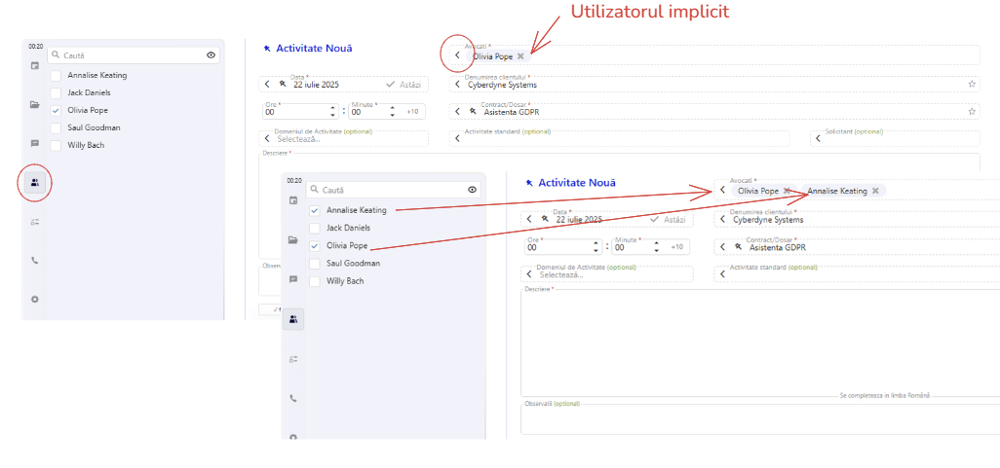

# Introducerea Activităților (Timesheet)

## Preambul
Introducerea se efectuează în Formularul de editare a activității.

### Logica de completare - generalități

Aplicația sugerează **valori implicite** pentru anumite câmpuri, în funcție de context.

Apoi procedează la completarea **câmp cu câmp** a datelor din Formularul de introducere a activităților.

#### Completarea unei casete se face 
   - fie prin **selecție** din Panoul de selecție (Calendar, Avocat, Client/Contract, Domeniul de activitate, Activitatea standard, Solicitantul). Se deschide panoul (câteva exemple mai jos) și din panou se alege valoarea corespunzătoare.
   - fie prin **scriere directă** în editor (Activitate, Observații).

##### Selecția: Deschiderea panoului de selecție

- A) Fie că selectăm pe rând fiecare element din panoul de selecție din stânga:

- B) Fie că deschidem fiecare element folosind săgeata stânga din editor
 
 Spre exemplu, pentru a modifica valoarea din caseta "data"

 Alt exemplu, pentru a selecta un client/dosar

Alt exemplu, pentru a selecta un solicitantul unei activități

##### Scrierea directă

Se completează pur și simplu textul, direct în formular. Câteva detalii particulare le vom descrie la capitolul destinat fiecărui editor în parte.

#### Ordinea de completare

Ideal este să selectăm cât mai devreme **CLIENT / DOSAR** - asta pentru că odată cu selectarea dosarului se încarcă și regulile și drepturile de completare.

#### Obligativitatea completării 

Dacă un element este opțional atunci este marcat ca atare "('Opțional')" - cu verde
Dacă un element este obligatoriu atunci acesta este marcat cu o steluță roșie.

#### Câmpuri invalide
La salvare, câmpurile invalide se evidențiază vizual, cu roșu.

Sunt și alte elemente care atrag atenția asupra unei posibile erori (mesaje, carduri de validare samd).

## Trecerea în revistă a elementelor de introducere

Fiecare element în parte a fost descris ca funcționalitate în capitolul [Elementele vizuale](./1%20Elementele%20vizuale.md)
Vom reveni acum doar pentru a puncta rolul respectivului element în procesul de introducere a unei activități.

### Calendar - Caseta de dată

<!-- Calendarul se initalizeaza cu ziua in curs si ramane setat pe ultima zi in care am introdus o activitate. -->

Am văzut mai sus [cum se deschide panoul de selecție pentru data, calendarul](#modificare-data)

Apoi, se poate selecta o altă zi validă din calendar. 

Comenzile sunt destul de intuitive. 

- "**Astăzi**" - în calendar - navighează la ziua curentă.
  
- "**>> Astăzi**" - în caseta de dată - navighează la ziua curentă.
    Dacă ziua pentru care se introduce activitatea este diferită de ziua curentă, butonul se activează într-un mod vizual mai evident, pentru a atrage atenția asupra unei posibile introduceri greșite. Asta pentru că uzual și ideal este să se introducă activități pentru ziua curentă și nu în trecut.

- "**Pin**" - în caseta de dată - fixează data selectată la momentul în care a fost bifată, ca dată pentru introducerea activităților.
   Apoi, dacă se navighează la o altă dată, cea pentru introducere rămâne fixă;

:::note
Regulile după care rulează diferite validări (dacă dosarul este accesibil sau dacă perioada aleasă nu este blocată) sunt specifice fiecărui dosar.
:::

### Avocați

Automat este selectat utilizatorul curent.
Dacă sunt drepturi suficiente, acesta poate selecta și alți utilizatori.
Regulile decurg din politica de lucru a fiecărei societăți și de drepturile de acces ale fiecărui utilizator.

 

:::info
Nu se poate modifica valoarea editorului decât **după completarea câmpului "Dosar"**, întrucât programul trebuie să analizeze dacă terți utilizatori au acces la dosarul respectiv.
:::

:::info
Nu se pot introduce activități pentru terți utilizatori care nu au acces la dosarul respectiv.
Aceștia apar în lista însă căsuța de bifare este inactivă.
:::

<!-- Anunță POST FACTUM dacă ziua selectată este nu primește activități -->

### Clienți și Dosare

Trebuie știut că în arborele de clienți/dosare sunt doar dosarele pentru care utilizatorul curent are drept de introducere a activităților.

### Timpul de lucru (ore, minute)

Editoarele sunt limitate la 23 ore și 59 minute.
<!-- Editoarele recompun datele si salveaza corect in format "hh:mm" timpul inregistrat -->

:::warning
Această secțiune a manualului nu este finalizată încă. Revenim în curând cu completări. Dacă sunt întrebări urgente ne puteți contacta la adresa de email: support@softwiz.ro
:::