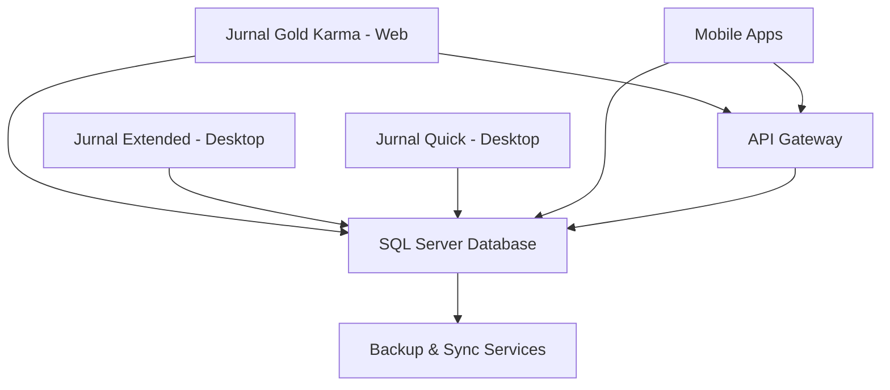
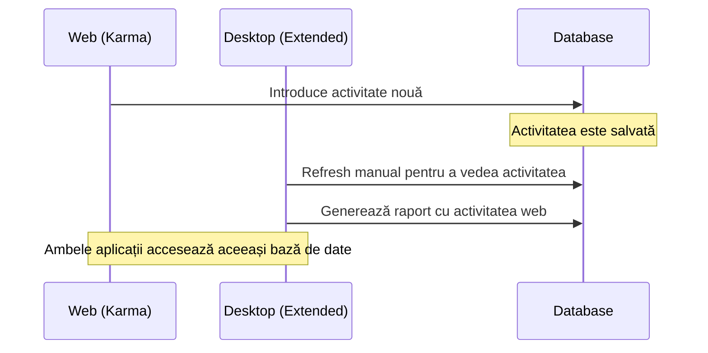

# Integrarea cu Desktop

## Arhitectura sistemului

### Componente principale



#### Baza de date centralizată
- **SQL Server**: Baza de date comună pentru toate aplicațiile
- **Partajarea datelor**: Aceeași informație accesibilă din toate interfețele
- **Consistență datelor**: Aceleași reguli de validare în toate interfețele
- **Backup centralizat**: O singură sursă de adevăr pentru toate datele

#### API Gateway
- **Interfață unificată**: Acces standardizat la date
- **Autentificare centralizată**: Single sign-on între aplicații
- **Rate limiting**: Protecție împotriva supraîncărcării
- **Monitoring**: Urmărirea performanței și utilizării

## Sincronizarea datelor

### Sincronizarea datelor

#### Direcția sincronizării
- **Desktop → Web**: Modificările din aplicațiile desktop sunt vizibile în web
- **Web → Desktop**: Modificările din web necesită refresh manual în desktop
- **Baza de date comună**: Toate aplicațiile accesează aceeași bază de date SQL Server

#### Tipuri de date partajate
1. **Activități**: Timesheet-urile introduse în orice aplicație
2. **Clienți și dosare**: Informații comune pentru toate interfețele
3. **Utilizatori**: Aceleași conturi și permisiuni
4. **Configurări**: Setări comune de business

### Gestionarea conflictelor

#### Scenarii de conflict
- **Editare simultană**: Același record modificat în paralel
- **Ștergere vs. modificare**: Un utilizator șterge, altul modifică
- **Permisiuni**: Modificări care depășesc drepturile utilizatorului

#### Rezolvarea conflictelor
```javascript
// Exemplu algoritm rezolvare conflicte
{
  "strategy": "last-write-wins",
  "exceptions": {
    "financial_data": "manual_review",
    "client_info": "merge_changes",
    "time_entries": "timestamp_priority"
  }
}
```

## Compatibilitatea funcțiilor

### Funcții comune

| Funcționalitate | Web (Karma) | Desktop (Extended) | Desktop (Quick) |
|---|---|---|---|
| **Introducere timesheet** | ✅ Complet | ✅ Complet | ✅ Complet |
| **Cronometru** | ✅ Avansat | ❌ Nu | ✅ Basic |
| **Rapoarte** | ✅ Basic | ✅ Complet | ✅ Limitat |
| **Gestionare clienți** | ✅ Vizualizare | ✅ Complet | ❌ Nu |
| **Facturare** | ❌ Nu | ✅ Complet | ❌ Nu |
| **Configurări** | ✅ Personale | ✅ Complete | ✅ Limitate |

### Funcții exclusive web

#### Avantaje specifice web
- **Accesibilitate**: De oriunde, orice dispozitiv
- **Clipboard avansat**: Cut, copy, paste pentru activități
- **Interfață modernă**: Design responsiv și intuitiv
- **Editor rich text**: Formatare avansată pentru descrieri
- **Colaborare**: Partajare ușoară de linkuri și rapoarte

#### Funcții exclusive desktop
- **Facturare completă**: Generare facturi fiscale
- **Rapoarte avansate**: Export Excel complex
- **Configurări sistem**: Administrare utilizatori
- **Integrări locale**: Printer, scanner, fax
- **Performance**: Procesare rapidă volume mari de date

## Workflow-uri hibride

### Scenarii de utilizare

#### Avocatul mobil
1. **Dimineața**: Verifică programul în aplicația web
2. **La tribunal**: Pornește cronometrul pe mobil
3. **În pauze**: Adaugă note și detalii
4. **Seara**: Finalizează rapoartele pe desktop

#### Echipa distribuită
1. **Manager**: Monitorizează progresul în web
2. **Avocați**: Introduc timpul în aplicația preferată
3. **Secretar**: Gestionează contactele pe desktop
4. **Financiar**: Generează facturile pe desktop

#### Workflow tipic


## Migrarea datelor

### De la desktop la web

#### Pregătirea migrării
1. **Backup complet**: Salvați toate datele existente
2. **Verificare integritate**: Testați consistența datelor
3. **Mapare utilizatori**: Asociați conturile desktop cu web
4. **Test environment**: Testați migrarea pe date de test

#### Procesul de migrare
```sql
-- Exemplu script migrare activități
INSERT INTO web_activities (
    user_id, client_id, case_id, activity_type,
    start_time, duration, description, created_date
)
SELECT 
    u.web_user_id, c.client_id, cs.case_id, a.activity_type,
    a.start_time, a.duration, a.description, a.created_date
FROM desktop_activities a
JOIN user_mapping u ON a.user_id = u.desktop_user_id
JOIN clients c ON a.client_code = c.client_code
JOIN cases cs ON a.case_number = cs.case_number
WHERE a.created_date >= '2024-01-01'
```

### Sincronizare continuă

#### Configurare sincronizare
- **Frecvența**: Timp real pentru activități, zilnic pentru metadata
- **Direcția**: Bidirectional pentru activități, unidirectional pentru configurări
- **Filtrare**: Doar datele relevante pentru fiecare aplicație
- **Monitoring**: Alerte pentru eșecuri de sincronizare

## Administrare și monitorizare

### Dashboard administrativ

#### Metrici de monitorizare
- **Utilizatori activi**: Web vs. desktop
- **Performanță**: Timp de răspuns pentru fiecare interfață
- **Sincronizare**: Status și erori
- **Utilizare resurse**: CPU, memorie, bandwidth

#### Alerte și notificări
```yaml
# Configurare alerte
alerts:
  - name: "Sync Failure"
    condition: "sync_errors > 5 in 10 minutes"
    action: "email admin + slack notification"
  
  - name: "High Response Time"
    condition: "avg_response_time > 2 seconds"
    action: "scale up servers"
  
  - name: "Database Lock"
    condition: "db_locks > 100"
    action: "investigate + notify DBA"
```

### Backup și disaster recovery

#### Strategia de backup
1. **Backup incremental**: La fiecare 4 ore
2. **Backup complet**: Zilnic la 2:00 AM
3. **Backup off-site**: Săptămânal în cloud
4. **Test recovery**: Lunar pe environment de test

#### Planul de continuitate
- **RTO** (Recovery Time Objective): 4 ore
- **RPO** (Recovery Point Objective): 1 oră
- **Failover automat**: Pentru componente critice
- **Comunicare**: Plan de notificare utilizatori

## Troubleshooting

### Probleme comune

#### Sincronizare întârziată
**Simptome**: Datele nu apar instant în toate aplicațiile
**Cauze**: Conexiune lentă, server supraîncărcat, erori de sincronizare
**Soluții**:
1. Verificați conexiunea la internet
2. Restartați serviciul de sincronizare
3. Forțați sincronizarea manuală

#### Conflicte de date
**Simptome**: Versiuni diferite ale aceluiași record
**Cauze**: Editare simultană, probleme de rețea
**Soluții**:
1. Identificați sursa conflictului
2. Alegeți versiunea corectă
3. Aplicați manual modificările necesare

#### Performanță scăzută
**Simptome**: Încărcare lentă, timeout-uri
**Cauze**: Volum mare de date, server supraîncărcat
**Soluții**:
1. Optimizați query-urile de bază de date
2. Implementați cache-ing
3. Scalați resursele serverului

### Suport tehnic

#### Niveluri de suport
1. **Nivel 1**: Probleme utilizatori (resetare parole, ghidare utilizare)
2. **Nivel 2**: Probleme tehnice (sincronizare, performanță)
3. **Nivel 3**: Probleme complexe (arhitectură, dezvoltare)

#### Informații necesare pentru suport
- **Versiunea aplicației**: Web și desktop
- **Browser și versiune**: Pentru probleme web
- **Mesaje de eroare**: Screenshot-uri și log-uri
- **Pași de reproducere**: Descriere detaliată
- **Impactul problemei**: Câți utilizatori sunt afectați

:::info Notă importantă
Aplicațiile web și desktop partajează aceeași bază de date. Modificările din desktop sunt vizibile în web, dar pentru a vedea modificările din web în desktop este necesar un refresh manual.
:::

:::tip Recomandare
Pentru cea mai bună experiență, utilizați aplicația web pentru introducerea rapidă a timpului și aplicația desktop pentru rapoarte complexe și facturare.
:::
